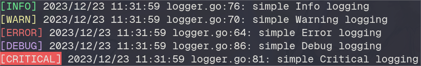

# Simple Logger



This package is built on top of `log`, the main reason for this is that I don't need to make the same configuration on each project.

# To install

```
go get -v github.com/rfbatista/logger
```

# Usage

```go
c, _ := logger.New(logger.LoggerConfig{WriteTo: os.Stdout, LogLevel: logger.Error, WithDateTime: true})
c.Info("Simple Logger")
```
